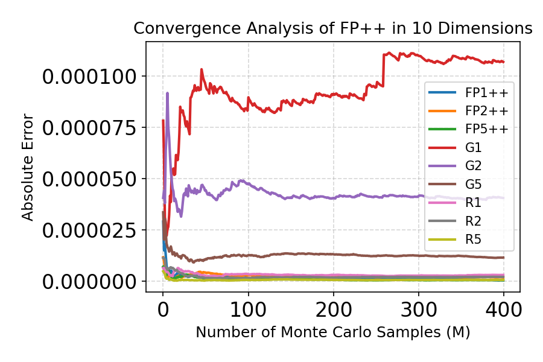
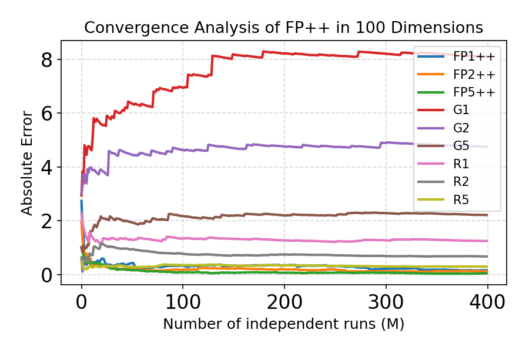
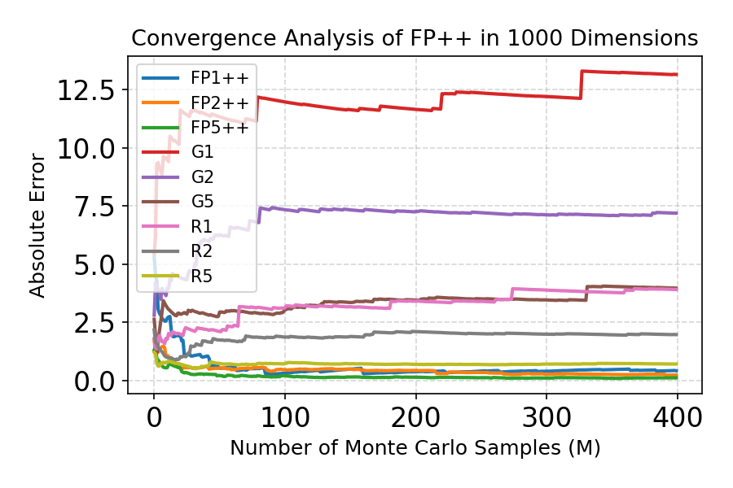

### Table 1: Variance of entropy estimator (1000 samples) across methods and dimensionalities

BF Jacobian denotes ground truth. Methods with prefix FP use finite-difference FP/FP++, where the number indicates the number of probes (e.g., FP1 uses 1 probe per estimate). Methods denoted as Gk and Rk correspond to Hutchinson estimators using Gaussian and Rademacher probes respectively, where k indicates the number of probes.

| Method   | GMM 10D | GMM 100D | GMM 1000D |
|----------|--------:|---------:|----------:|
| BF Jacobian | 0.9265 | 1.5931 | 11.0544 |
| FP1      | 1.6886 | 10.2365 | 37.6025 |
| FP2      | 1.4847 | 8.0238 | 35.3451 |
| FP5      | 1.1487 | 6.5414 | 31.2574 |
| FP10     | 0.9597 | 5.3718 | 29.4457 |
| FP1++    | 0.9456 | 1.8040 | 11.4718 |
| FP2++    | 0.9393 | 1.6681 | 11.3622 |
| FP5++    | 0.9259 | 1.6174 | 11.1046 |
| FP10++   | 0.9255 | 1.6193 | 11.1099 |
| G1       | 1.1992 | 2.7067 | 12.8340 |
| G2       | 1.1018 | 2.1713 | 12.0969 |
| G5       | 0.9930 | 1.8662 | 11.5580 |
| G10      | 0.9503 | 1.7211 | 11.2355 |
| R1       | 0.9394 | 1.7396 | 11.3268 |
| R2       | 0.9378 | 1.6757 | 11.1838 |
| R5       | 0.9266 | 1.6275 | 11.1346 |
| R10      | 0.9281 | 1.6109 | 11.0810 |

## FP++ Convergence Analysis
The x-axis shows the number of independent runs (M). The y-axis shows the estimation error, defined as the average absolute difference between the estimated Jacobian determinant and the ground-truth value, averaged over both runs and a fixed set of samples (number=5). The plot illustrates how the estimation error decreases as M increases, demonstrating the convergence behavior of the estimator.
### 10D

  

### 100D

  

### 1000D

  

### Table 2: Stability evaluation on the Chignolin system across 10 independent runs

We report results over 10 independent runs. “Proportion” denotes the fraction of particles located in the right basin (corresponding to the β-hairpin configuration), while “# Preserved” denotes the number of preserved lineages after resampling. FP++ variants show consistent performance across runs.

| Method | Metric      | 1 | 2 | 3 | 4 | 5 | 6 | 7 | 8 | 9 | 10 | Mean   | Std   |
|--------|-------------|--:|--:|--:|--:|--:|--:|--:|--:|--:|---:|-------:|------:|
| FP++   | Proportion  | 0.364 | 0.3745 | 0.360 | 0.3455 | 0.354 | 0.3855 | 0.3775 | 0.358 | 0.3515 | 0.3875 | 0.3658 | 0.0146 |
| FP++   | # Preserved | 1463  | 1495  | 1461  | 1451  | 1498  | 1477  | 1491  | 1447  | 1480  | 1475  | 1473.8 | 18.0   |
